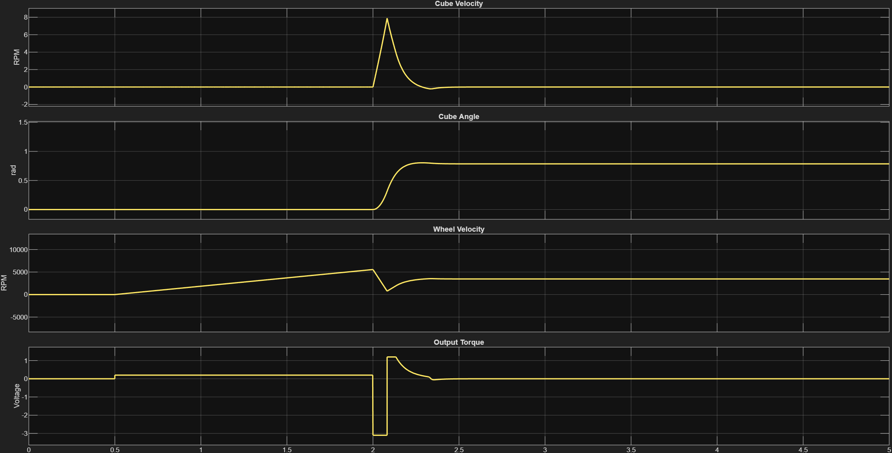

# 3D-Cubli-Self-Balancing-Dynamics
Dynamic modeling and control simulations for corner balancing a 3D Cubli. Implements Sliding Mode Control (SMC) for robust stabilization. Utilizes quaternions and rigid transforms to manage 3D spatial dynamics, mitigating non-linear gyroscopic coupling effects while employing stiff solvers to ensure rigorous numerical simulation stability.

# 3D Cubli: Edge Stabilization and Dynamic Control

## 📌 Overview
This project focuses on the dynamic modeling and control system simulation of a 3D Cubli. The current phase successfully achieves robust edge balancing using advanced control theory. This serves as a critical intermediate milestone in managing multi-body dynamics before scaling up to full 3D spatial vertex (corner) balancing.

## 🎥 Simulation Showcase
<video src="Results/DoF3_Cubli_Edge_side.mp4" controls="controls" width="100%"></video>

https://github.com/user-attachments/assets/060db56e-a1da-4f2b-93d6-429a7efa1a30

*Simulation of the Cubli reaching and maintaining edge stabilization using SMC.*

## ⚙️ Current Control Architecture: Edge Balancing

Balancing the cube along a 1D edge requires rejecting internal parameter variations and external disturbances.

* **Sliding Mode Control (SMC):** Implemented to achieve robust edge stabilization. SMC drives the system states to a sliding surface and maintains them there, providing high accuracy despite non-linear system dynamics.
* **Numerical Stability:** Employed stiff solvers (ode23 Bogacki-Shampine) to maintain precision throughout the dynamic simulation, preventing integration failures caused by rapid reaction wheel dynamics.

## 📈 System Performance & Plots

## 🚀 Current Focus & Future Scope (Full 3D Balancing)

The active development phase is focused on transitioning from edge stabilization to full 3D vertex (corner) balancing. This requires significantly more complex spatial mathematics and control logic:

* **Quaternion-Based Kinematics:** Transitioning spatial dynamics to quaternions and rigid transforms to avoid gimbal lock during full 3D rotation.
* **Gyroscopic Decoupling:** Upgrading the control law to actively address and mitigate the highly non-linear gyroscopic coupling effects generated by all three internal reaction wheels spinning simultaneously.
* **Multi-Axis SMC:** Expanding the Sliding Mode Controller to handle simultaneous, coupled multi-axis stabilization.

## 📂 Repository Structure
* `/Models` - Contains the primary dynamic models for edge balancing.
* `/Controllers` - Houses the active SMC control logic.
* `/Results` - Simulation output data and generated plots.

## 🛠️ How to Run the Simulation
1. Clone this repository.
2. Open `[Insert main file name, e.g., main_sim.m]` in `[Software, e.g., MATLAB]`.
3. Run the script to initialize parameters and begin the edge stabilization sequence.
